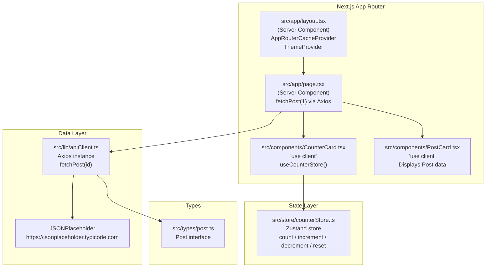

# Design Document: HelloWorld Next.js Project

## Overview

This document describes the technical design for the HelloWorld Next.js demonstration project located at `D:\kiro`. The project is a single-page application built with Next.js 16 (App Router), TypeScript 6 strict mode, MUI v9, Zustand 5, Axios 1.13, Vitest 4, and pnpm 10 (Node.js 24 LTS). It exists to validate that all organisational tooling standards are configured correctly and work together.

**Key design goals:**
- Minimal surface area — one route (`/`), one page, one store, one API call.
- Correct SSR/hydration setup for MUI with the App Router.
- Client-state (Zustand counter) isolated to a `'use client'` component so the Server Component tree is not polluted.
- Axios fetching done server-side in the root page (RSC), passing data down as props to avoid client-side waterfall on first load.
- Vitest tests operate entirely in-memory (jsdom + mocked Axios); no real HTTP calls in tests.

---

## Architecture



The page is a **React Server Component** that calls `fetchPost(1)` at request time and passes the result as a prop to `<PostCard>`. This avoids exposing the Axios call to the browser bundle. Both `<CounterCard>` and `<PostCard>` are Client Components (`'use client'`) because they either use Zustand hooks or render interactive MUI components.

---

## Components and Interfaces

### `src/app/layout.tsx` (Server Component)

Root layout that wraps the app with MUI's SSR cache provider and custom theme:

```tsx
import { AppRouterCacheProvider } from '@mui/material-nextjs/v16-appRouter';
import { ThemeProvider } from '@mui/material/styles';
import { Roboto } from 'next/font/google';
import theme from '@/theme';

const roboto = Roboto({
  weight: ['300', '400', '500', '700'],
  subsets: ['latin'],
  display: 'swap',
  variable: '--font-roboto',
});

export default function RootLayout({ children }: { children: React.ReactNode }) {
  return (
    <html lang="en" className={roboto.variable}>
      <body>
        <AppRouterCacheProvider>
          <ThemeProvider theme={theme}>
            {children}
          </ThemeProvider>
        </AppRouterCacheProvider>
      </body>
    </html>
  );
}
```

> `AppRouterCacheProvider` (from `@mui/material-nextjs/v16-appRouter`) collects Emotion CSS on the server and appends it to `<head>` rather than `<body>`, preventing style flickering. ([MUI docs](https://mui.com/material-ui/integrations/nextjs/))

### `src/theme.ts` (Client module)

```tsx
'use client';
import { createTheme } from '@mui/material/styles';

const theme = createTheme({
  typography: { fontFamily: 'var(--font-roboto)' },
  cssVariables: true,       // prevents SSR flicker
});

export default theme;
```

### `src/app/page.tsx` (Server Component)

```tsx
import Container from '@mui/material/Container';
import Typography from '@mui/material/Typography';
import Box from '@mui/material/Box';
import { fetchPost } from '@/lib/apiClient';
import CounterCard from '@/components/CounterCard';
import PostCard from '@/components/PostCard';

export default async function Home() {
  let post = null;
  let error: string | null = null;

  try {
    post = await fetchPost(1);
  } catch {
    error = 'Failed to load post. Please try again later.';
  }

  return (
    <Container maxWidth="sm" sx={{ py: 6 }}>
      {/* MUI v9: no system props on Typography — use sx instead */}
      <Typography variant="h2" component="h1" sx={{ gutterBottom: true }}>
        Hello World
      </Typography>
      <CounterCard />
      <PostCard post={post} error={error} />
    </Container>
  );
}
```

### `src/components/CounterCard.tsx` (Client Component)

```tsx
'use client';
import Box from '@mui/material/Box';
import Button from '@mui/material/Button';
import ButtonGroup from '@mui/material/ButtonGroup';
import Typography from '@mui/material/Typography';
import { useCounterStore } from '@/store/counterStore';

export default function CounterCard() {
  const { count, increment, decrement, reset } = useCounterStore();
  return (
    // MUI v9: spacing via sx prop only — no system props (mt, mb, etc.)
    <Box sx={{ my: 3 }}>
      <Typography variant="h5">Counter: {count}</Typography>
      <ButtonGroup sx={{ mt: 1 }}>
        <Button onClick={decrement}>−</Button>
        <Button onClick={reset}>Reset</Button>
        <Button onClick={increment}>+</Button>
      </ButtonGroup>
    </Box>
  );
}
```

### `src/components/PostCard.tsx` (Client Component)

```tsx
'use client';
import Card from '@mui/material/Card';
import CardContent from '@mui/material/CardContent';
import Typography from '@mui/material/Typography';
import Alert from '@mui/material/Alert';
import type { Post } from '@/types/post';

interface PostCardProps {
  post: Post | null;
  error: string | null;
}

export default function PostCard({ post, error }: PostCardProps) {
  if (error) return <Alert severity="error">{error}</Alert>;
  if (!post) return null;
  return (
    // MUI v9: sx prop for spacing; no system props directly on Card
    <Card variant="outlined" sx={{ mt: 3 }}>
      <CardContent>
        {/* MUI v9: no `paragraph` prop — use sx for margin if needed */}
        <Typography variant="h6">{post.title}</Typography>
        <Typography variant="body2" sx={{ color: 'text.secondary' }}>{post.body}</Typography>
      </CardContent>
    </Card>
  );
}
```

---

## Data Models

### `src/types/post.ts`

```typescript
export interface Post {
  id: number;
  userId: number;
  title: string;
  body: string;
}
```

### Zustand Store — `src/store/counterStore.ts`

```typescript
import { create } from 'zustand';

interface CounterState {
  count: number;
  increment: () => void;
  decrement: () => void;
  reset: () => void;
}

export const useCounterStore = create<CounterState>((set) => ({
  count: 0,
  increment: () => set((state) => ({ count: state.count + 1 })),
  decrement: () => set((state) => ({ count: state.count - 1 })),
  reset: () => set({ count: 0 }),
}));
```

> Because this is a simple HelloWorld project, the store is used only inside `<CounterCard>` (a Client Component). Per-request isolation (needed when Zustand state is initialised server-side) is not required here. ([Zustand Next.js guide](https://zustand.docs.pmnd.rs/learn/guides/nextjs))

### Axios Client — `src/lib/apiClient.ts`

```typescript
import axios from 'axios';
import type { Post } from '@/types/post';

export const apiClient = axios.create({
  baseURL: 'https://jsonplaceholder.typicode.com',
  timeout: 5000,
});

export async function fetchPost(id: number): Promise<Post> {
  const { data } = await apiClient.get<Post>(`/posts/${id}`);
  return data;
}
```

---

## Correctness Properties

*A property is a characteristic or behavior that should hold true across all valid executions of a system — essentially, a formal statement about what the system should do. Properties serve as the bridge between human-readable specifications and machine-verifiable correctness guarantees.*

### Property 1: Counter increment accumulates correctly

*For any* non-negative integer `n`, calling `increment` exactly `n` times on a store whose `count` starts at `0` SHALL result in `count === n`.

**Validates: Requirements 4.3, 4.7**

---

### Property 2: Counter decrement accumulates correctly

*For any* non-negative integer `n`, calling `decrement` exactly `n` times on a store whose `count` starts at `0` SHALL result in `count === -n`.

**Validates: Requirements 4.4, 4.8**

---

### Property 3: Reset is idempotent regardless of prior state

*For any* integer value of `count` (positive, negative, or zero), calling `reset` SHALL always produce `count === 0`, and calling `reset` a second time SHALL leave `count === 0` (idempotence).

**Validates: Requirements 4.5, 4.9**

---

### Property 4: fetchPost id round-trip

*For any* valid positive integer `id`, calling `fetchPost(id)` with a mocked response whose `id` equals the requested value SHALL return a `Post` object where `post.id === id`.

**Validates: Requirements 5.6**

---

### Property 5: PostCard renders all Post fields

*For any* `Post` object (with arbitrary `title` and `body` strings), rendering `<PostCard post={post} error={null} />` SHALL produce output that contains both `post.title` and `post.body`.

**Validates: Requirements 5.3**

---

## Error Handling

| Scenario | Handling |
|---|---|
| `fetchPost` network/server error | Caught in `page.tsx` try-catch; `error` string passed to `<PostCard>` which renders an MUI `<Alert severity="error">` |
| TypeScript type error at build | `tsc --noEmit` (or `next build`) exits non-zero; CI catches this |
| Vitest test failure | Vitest exits non-zero; `pnpm test` propagates the exit code |
| Zustand store accessed in RSC | Not possible by design — store is only imported by Client Components |

**Error boundary strategy:** The try-catch in `page.tsx` is sufficient for the single async operation on this page. A React `ErrorBoundary` component is not needed at this scale but can be added as the project grows.

---

## Testing Strategy

### Test framework

- **Vitest** with `jsdom` environment and `globals: true`
- **@testing-library/react** for component rendering
- **@testing-library/jest-dom** for DOM matchers
- **vitest-axe** or `vi.mock` for Axios mocking

### `vitest.config.ts`

```typescript
import { defineConfig } from 'vitest/config';
import react from '@vitejs/plugin-react';
import path from 'path';

export default defineConfig({
  plugins: [react()],
  test: {
    environment: 'jsdom',
    globals: true,
    setupFiles: ['./src/test/setup.ts'],
  },
  resolve: {
    alias: {
      '@': path.resolve(__dirname, './src'),
    },
  },
});
```

### `src/test/setup.ts`

```typescript
import '@testing-library/jest-dom';
```

### Test files and coverage

| File | What it tests | PBT? |
|---|---|---|
| `src/store/counterStore.test.ts` | `increment`, `decrement`, `reset` across many values | Yes — Property 1, 2, 3 |
| `src/lib/apiClient.test.ts` | `fetchPost` with mocked Axios | Yes — Property 4 |
| `src/components/PostCard.test.tsx` | PostCard rendering | Yes — Property 5 |
| `src/components/CounterCard.test.tsx` | Counter UI renders count and buttons | Example-based |

### Property-based testing library

**fast-check** (`fast-check` npm package) is used for property-based tests. It integrates cleanly with Vitest via `fc.assert(fc.property(...))`.

- Minimum **100 iterations** per property test (fast-check default).
- Each property test is tagged: `// Feature: hello-world-nextjs, Property N: <description>`.

### Dual-testing approach

- **Unit / example tests**: verify concrete behaviour (counter renders "0", buttons exist, error alert shown on API failure).
- **Property tests**: verify universal invariants (increment n times → count is n, reset always → 0, fetchPost id preserved).
- Together these catch both concrete bugs and edge-case regressions.

### Why PBT applies here

- The counter store is a **pure state machine** — behaviour varies meaningfully with the number of calls.
- `fetchPost` is a **pure function over its id argument** — the id-preservation invariant holds for all valid integers.
- `PostCard` is a **pure render function** — the field-containment property holds for all Post values.
- All are in-memory / jsdom — 100 iterations are fast and cheap.

---

## Configuration Files

### `package.json` (key sections)

```json
{
  "name": "hello-world-nextjs",
  "version": "0.1.0",
  "packageManager": "pnpm@10.0.0",
  "engines": {
    "node": ">=24.0.0",
    "pnpm": ">=10.0.0"
  },
  "scripts": {
    "dev": "next dev --turbopack",
    "build": "next build",
    "start": "next start",
    "lint": "next lint",
    "test": "vitest --run",
    "typecheck": "tsc --noEmit"
  },
  "dependencies": {
    "next": "^16.0.0",
    "react": "^19.0.0",
    "react-dom": "^19.0.0",
    "@mui/material": "^9.0.0",
    "@mui/material-nextjs": "^9.0.0",
    "@emotion/react": "^11.0.0",
    "@emotion/styled": "^11.0.0",
    "@emotion/cache": "^11.0.0",
    "zustand": "^5.0.0",
    "axios": "^1.13.0"
  },
  "devDependencies": {
    "typescript": "^6.0.0",
    "@types/react": "^19.0.0",
    "@types/node": "^24.0.0",
    "vitest": "^4.0.0",
    "@vitejs/plugin-react": "^4.0.0",
    "jsdom": "^25.0.0",
    "@testing-library/react": "^16.0.0",
    "@testing-library/jest-dom": "^6.0.0",
    "fast-check": "^3.0.0"
  }
}
```

### `tsconfig.json` (key options)

```json
{
  "compilerOptions": {
    "target": "ES2017",
    "lib": ["dom", "dom.iterable", "esnext"],
    "allowJs": false,
    "skipLibCheck": true,
    "strict": true,
    "noEmit": true,
    "esModuleInterop": true,
    "module": "esnext",
    "moduleResolution": "bundler",
    "resolveJsonModule": true,
    "isolatedModules": true,
    "jsx": "preserve",
    "incremental": true,
    "plugins": [{ "name": "next" }],
    "paths": { "@/*": ["./src/*"] }
  },
  "include": ["next-env.d.ts", "**/*.ts", "**/*.tsx", ".next/types/**/*.ts"],
  "exclude": ["node_modules"]
}
```

### `next.config.ts`

```typescript
import type { NextConfig } from 'next';

const nextConfig: NextConfig = {
  // Turbopack is enabled via --turbopack CLI flag in the dev script.
  // No experimental.turbo config needed here.
};

export default nextConfig;
```

---

## MUI v9 API Rules

These rules apply to all component usage in the project and must be followed to avoid runtime warnings and build errors introduced by the v9 breaking changes.

| Rule | Detail |
|---|---|
| No system props on MUI components | `mt`, `mb`, `color`, `p`, etc. are **removed** from `Box`, `Typography`, `Stack`, `Grid`, `Link`, `DialogContentText`. Use `sx={{ mt: 2, color: '...' }}` instead. |
| No `paragraph` prop on `Typography` | Use `sx={{ marginBottom: '16px' }}` if needed. |
| No `components`/`componentsProps` | All component customisation uses `slots` and `slotProps` only. |
| No `GridLegacy` | Use `Grid` with `size={{ xs: 12, sm: 6 }}` (the `item` prop and `xs`/`sm` shorthand props are removed). |
| No `disableEscapeKeyDown` on Dialog/Modal | Handle escape via `reason` check in `onClose`. |
| `ButtonGroup` does not accept system props | Spacing from `ButtonGroup` must be via `sx`. |
| `color` on Typography | Pass as `sx={{ color: 'text.secondary' }}` instead of `color="text.secondary"`. |

---

## Folder Structure

```
D:\kiro\
├── public/
├── src/
│   ├── app/
│   │   ├── layout.tsx          # Root layout: AppRouterCacheProvider + ThemeProvider
│   │   └── page.tsx            # Home page: fetches Post, renders Counter + Post
│   ├── components/
│   │   ├── CounterCard.tsx     # 'use client' — Zustand counter UI
│   │   ├── CounterCard.test.tsx
│   │   ├── PostCard.tsx        # 'use client' — displays Post or error
│   │   └── PostCard.test.tsx
│   ├── lib/
│   │   ├── apiClient.ts        # Axios instance + fetchPost()
│   │   └── apiClient.test.ts
│   ├── store/
│   │   ├── counterStore.ts     # Zustand store
│   │   └── counterStore.test.ts
│   ├── test/
│   │   └── setup.ts            # @testing-library/jest-dom import
│   ├── theme.ts                # MUI theme (createTheme, cssVariables)
│   └── types/
│       └── post.ts             # Post interface
├── .eslintrc.json
├── next.config.ts
├── package.json
├── pnpm-lock.yaml
├── tsconfig.json
└── vitest.config.ts
```
